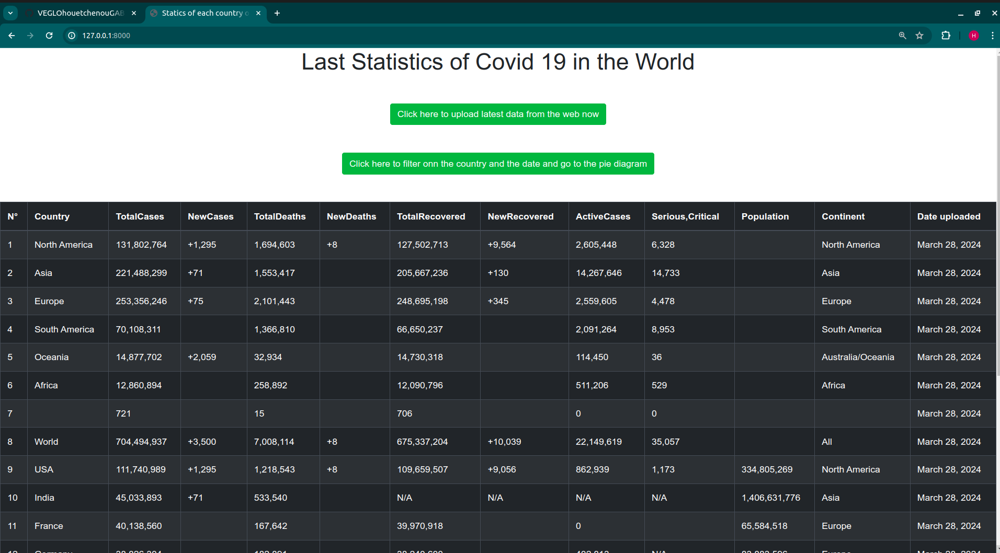
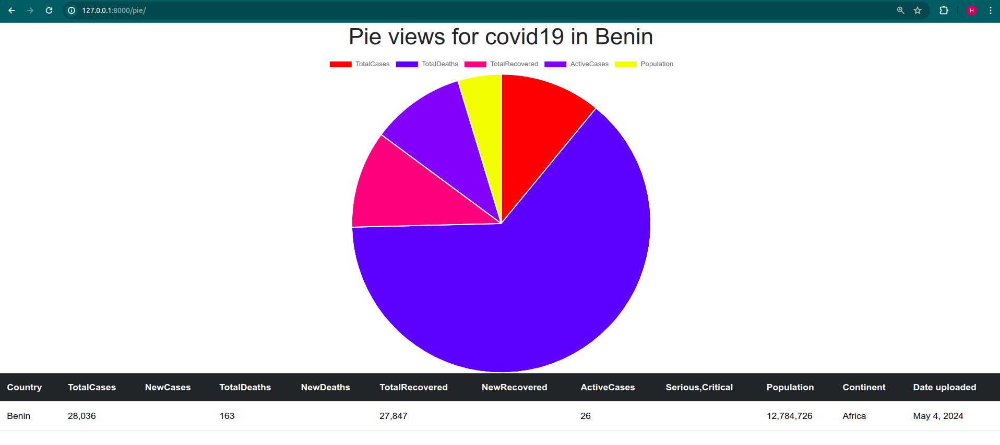
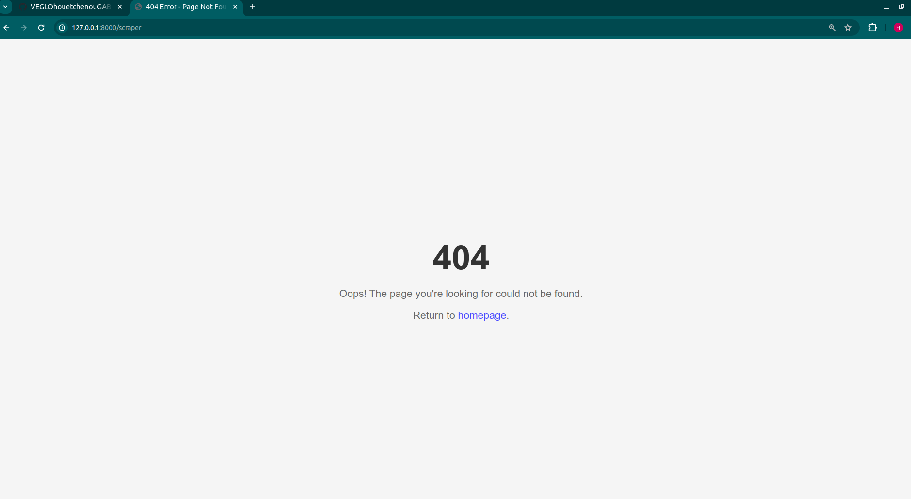

## COVID 19 DATA VISUALIZATION FOR ALL THE WORLD AND AN PUBLIC API FOR EVERYONE INTERESTED TO USE IT IN THEY OWN PROJECT

# COVID-19 Dashboard

## Overview
Welcome to the COVID-19 Dashboard, a personalized tool for tracking the latest COVID-19 statistics. This Django web application empowers users to stay informed about the pandemic's impact worldwide, providing a comprehensive set of features for data visualization and analysis.

## Features
- **Explore Global Data**: Dive into detailed COVID-19 statistics by country, including total cases, new cases, total deaths, new deaths, total recovered, and more.
- **Search and Filter**: Easily search for specific countries or filter statistics by date to uncover insights tailored to your needs.
- **Register New Statistics**: As an admin, you can register new statistics for specific countries to ensure accurate and up-to-date data representation.
- **Upload Latest Cases**: Keep the database current by uploading the latest COVID-19 cases from trusted sources directly through the application.
- **Error Handling**: Our custom 404 error page ensures a smooth user experience, even in the event of a page not found error.

## Requirements
To run the COVID-19 Dashboard on your local machine, you'll need:
- Python 3.x
- Django
- BeautifulSoup
- requests

## Installation
1. Clone the repository to your local machine.
2. Install dependencies using `pip install -r requirements.txt`.
3. Run migrations using `python manage.py migrate`.
4. Start the development server using `python manage.py runserver`.

## Usage
1. Access the dashboard at the specified URL.
2. Navigate through the intuitive interface to explore different features.
3. As an admin, you can register new statistics or upload the latest cases to keep the data fresh and relevant.

## Contributing
Your contributions are valuable! Feel free to fork the repository, make changes, and submit a pull request. Together, we can enhance this dashboard and make it even more impactful.

### **Contributors**
- [Gabin H. VEGLO](https://github.com/VEGLOhouetchenouGABIN/)

### **License**
This project is licensed under the **MIT License**.